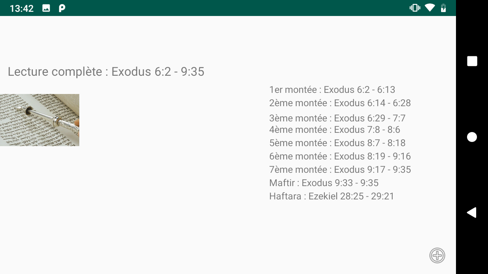

# Application mobile : CALENDAR

## Développeur (3A)

- Daniel Elgrably

&nbsp;

## Présentation

Simple projet démontrant l'utilisation d'API REST et de recyclerview dans une application android codé en Java.

Cette application affiche le calendrier des chabbats et fêtes juives en utilisant l'API suivante disponible sur Github : "https://www.hebcal.com/home/195/jewish-calendar-rest-api". Par ailleurs, toujours avec cette API, nous pouvons afficher les montées du chabat. En effet, chaque chabbat, nous lisons une section des livres du pentateuque, de façons à les finir en un ans. Cette section est subdivisée en 7 montées (sous section). Enfin, le "maftir" reprend les derniers versets de la septième montée. Puis la haftarah est constituée d'un passage tiré des livres des prophètes. 

&nbsp;

## Prérequis

- Installation d'Android Studio 
Ce projet est le premier que nous réalisons sous Android Studio, il n'y avait donc pas d'autres prérequis.

&nbsp;

## Consignes respectées : 

- Deux écrans; trois activités
- Recycler View
- Appels WebService à une API Rest
- Architecture MVC
- Animation entre deux écrans

&nbsp;

## Fonctionnalités: 

### Premier écran 

L'écran qui s'affiche au démarrage est l'écran d'accueil. Au commencement du chabbat ou des fêtes, nous avons l'habitude d'allumer deux bougies, c'est ce qui est représenté par le fond d'écran. 
Outre le titre, trois boutons sont proposés à l'utilsateur.
- Le premier, "Calendrier et horaires" ouvre une seconde activité affichant les prochains évènements.
- Le second, "Montées chabbat" ouvre une troisième activité affichant la répartition des montées pour la lecture de chabat.
- Le troisième, "Créateur" affiche un toast avec mon nom.

### Seconde activité

- Affiche la liste des prochains évènement avec leur catégorie, leur noms en anglais et en hébreu, ainsi que leur date.

   

### Troisième activité

- Affiche la liste des montées des lectures hebdomadaires.

  

